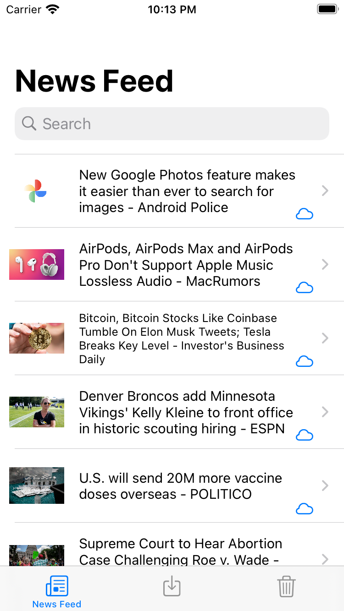
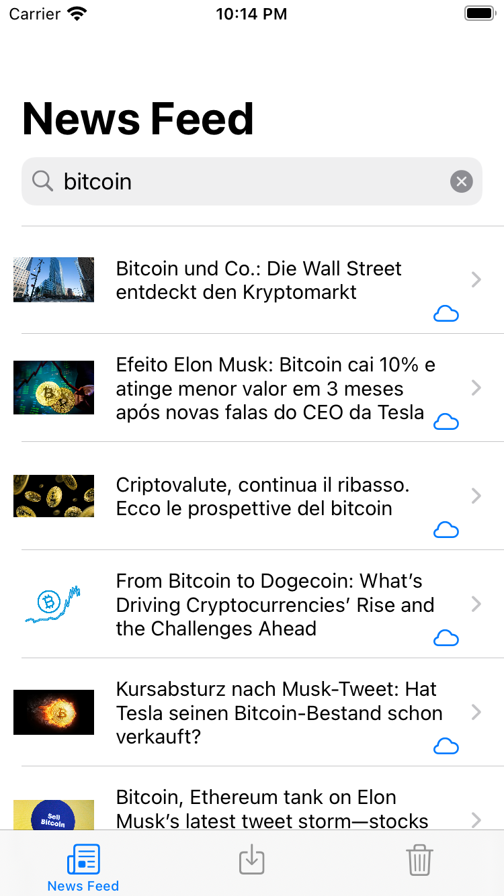
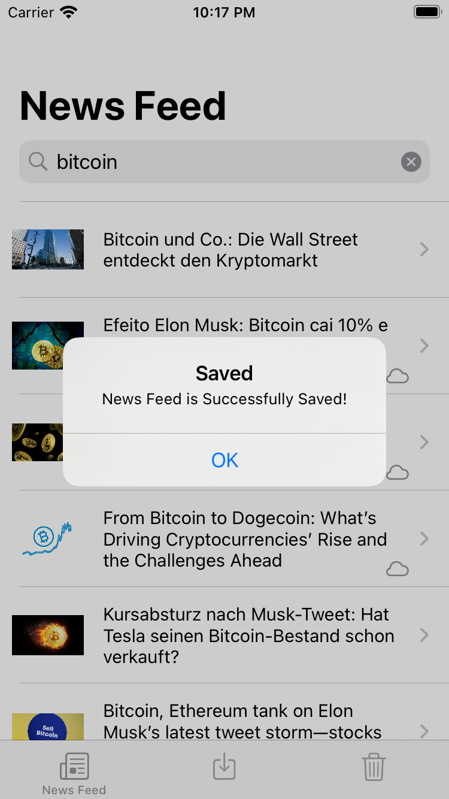
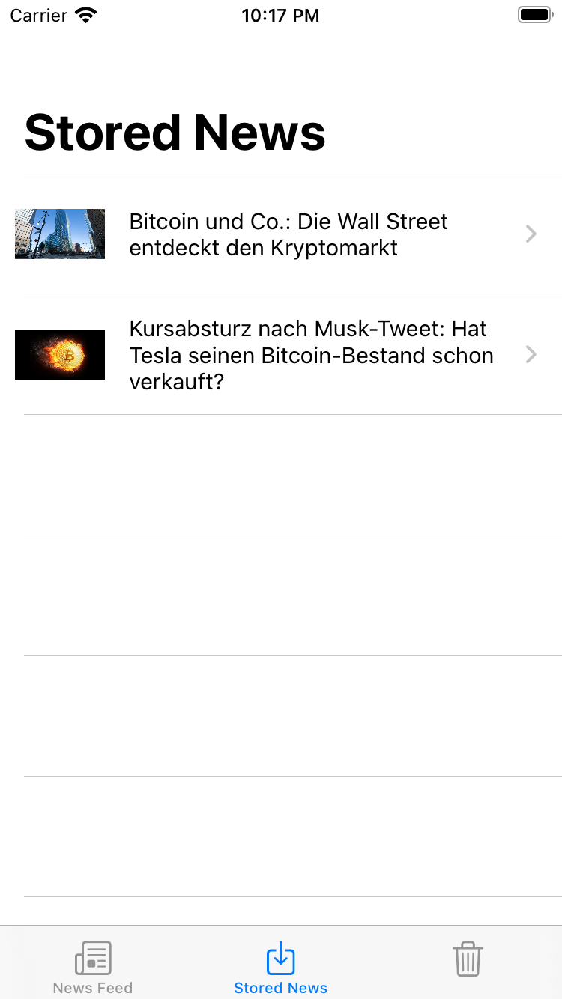
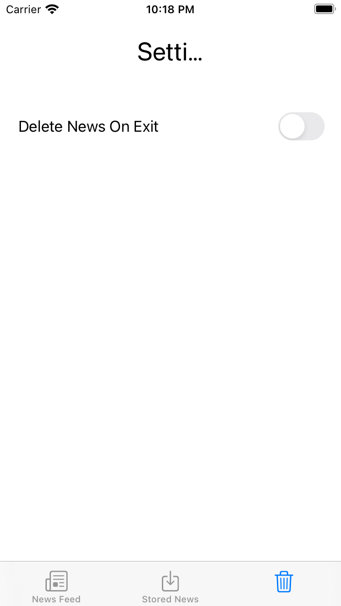

# News Feed

This App will help you save a news feed that you liked instantly 

## Description

this App is a Project For the Udacity iOS Nano Degree Program
- App Can fetch news From the API
- Search News By Keyword
- Store Liked News

## Getting Started

in Order to use the app you should get your own  Api Key from https://newsapi.org/

### Dependencies

* Xcode 12+, Swift 5.0

### Installing

* clone url to get started
* enter api Key in EndPoints.swift for the "apiKey" Variable

## Screenshots and How to Use

### Get latest Feed when you open the App

### Search for feed by Keyword

### Save Liked feeds by pressing on the cloud Button

### check stored Feed in the Stored Feeds Tab

### Delete Stored Feeds Upon terminating App Setting

## Authors

Contributors names and contact info

Pierre Younes
pyounes@gmail.com
[@pyounes](https://www.linkedin.com/in/pyounes/)

## Version History

* 1.0
    * Initial Release

## License

## Acknowledgments

Inspiration, code snippets, etc.
* [awesome-readme](https://github.com/matiassingers/awesome-readme)